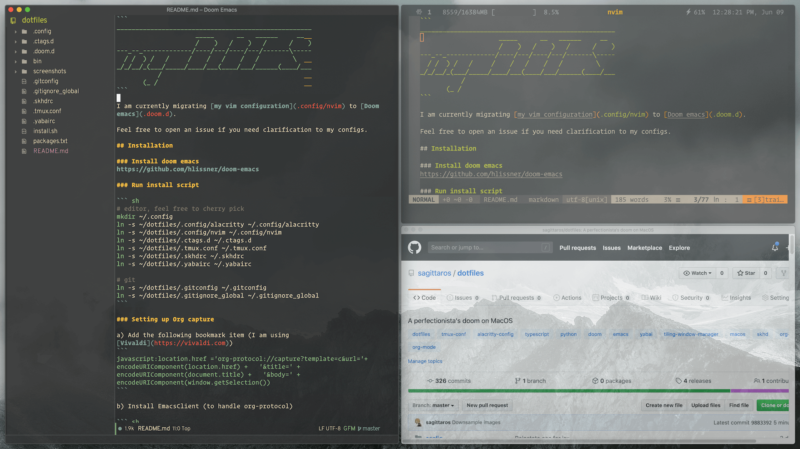
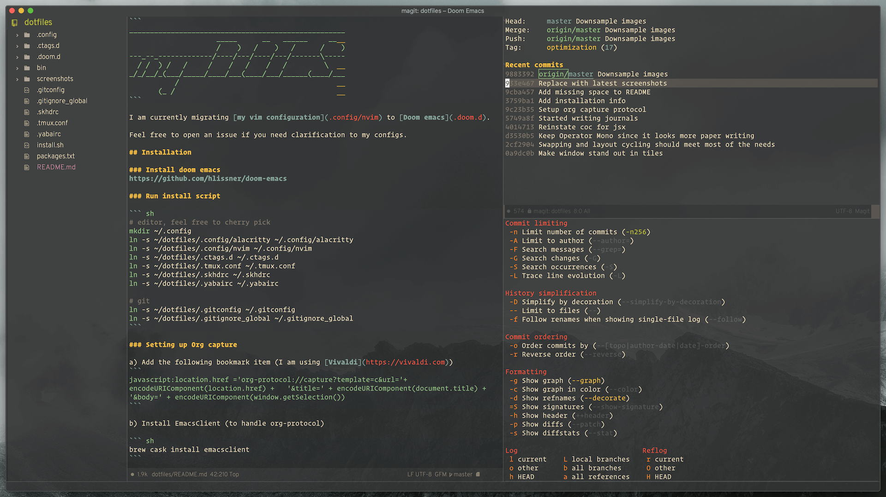
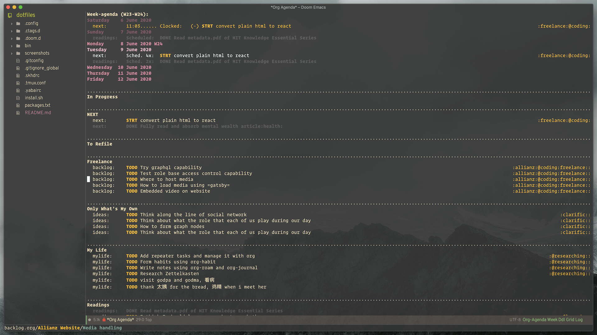
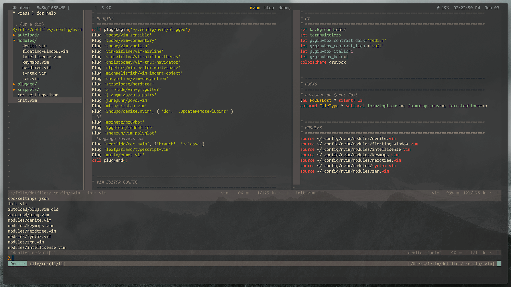

```
____________________________________________________
                     _____      __   ______     __  
                     /    )   /    )   /      /    )
---_--_-------------/----/---/----/---/-------\-----
  / /  ) /   /     /    /   /    /   /         \    
_/_/__/_(___/_____/____/___(____/___/______(____/___
           /                                        
       (_ /                                         
```

I am currently migrating [my vim configuration](.config/nvim) to [Doom emacs](.doom.d). 

Feel free to open an issue if you need clarification to my configs.

## Installation

### Install doom emacs
https://github.com/hlissner/doom-emacs

### Run install script

``` sh
# editor, feel free to cherry pick
mkdir ~/.config
ln -s ~/dotfiles/.config/alacritty ~/.config/alacritty
ln -s ~/dotfiles/.config/nvim ~/.config/nvim
ln -s ~/dotfiles/.ctags.d ~/.ctags.d
ln -s ~/dotfiles/.tmux.conf ~/.tmux.conf
ln -s ~/dotfiles/.skhdrc ~/.skhdrc
ln -s ~/dotfiles/.yabairc ~/.yabairc

# git
ln -s ~/dotfiles/.gitconfig ~/.gitconfig
ln -s ~/dotfiles/.gitignore_global ~/.gitignore_global
```

### Setting up Org capture

a) Add the following bookmark item (I am using [Vivaldi](https://vivaldi.com))
``` 
javascript:location.href ='org-protocol://capture?template=c&url='+   encodeURIComponent(location.href) +   '&title=' + encodeURIComponent(document.title) +   '&body=' + encodeURIComponent(window.getSelection())
```

b) Install EmacsClient (to handle org-protocol)

``` sh
brew cask install emacsclient
```

c) Inform emacsclient location using symlink

``` sh
ln -s /usr/local/bin/emacsclient /Applications/Emacs.app/Contents/MacOS/bin-x86_64-10_9/emacsclient
```


## Screenshots

### Yabai (Tiling Window Manager)



### Emacs (Editor View)




### Emacs (Org Agenda)




### Vim/Tmux/Alacritty



