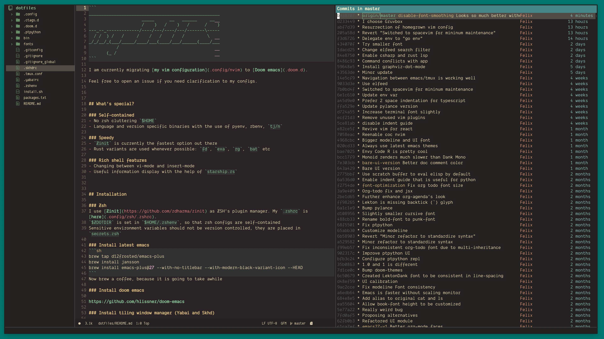

```
____________________________________________________
                     _____      __   ______     __  
                     /    )   /    )   /      /    )
---_--_-------------/----/---/----/---/-------\-----
  / /  ) /   /     /    /   /    /   /         \    
_/_/__/_(___/_____/____/___(____/___/______(____/___
           /                                        
       (_ /                                         
```

Feel free to open an issue if you need clarification to my configs.




## What's in the box?
- Somewhat heavily configurated [Emacs config](.doom.d) based on [Doom](https://github.com/hlissner/doom-emacs)
- Org Roam (aka Roam Research on Emacs)
- A working tiling window manager configuration for Mac (with [yabai](.yabairc))
- Minimal mouse dependency with [skhd](.skhdrc)
- Embedded [floating window](.config/nvim/modules/floating-window) in Vim, see [screenshot](screenshot-vim-modal.png)
- Seamless integration between [tmux](.tmux.conf), [vim](.config/nvim/) and [alacritty](.config/alacritty)


## What's special?

### Self-contained
- No zsh cluttering `$HOME`
- Language and version specific binaries with the use of pyenv, rbenv, `tj/n`

### Speedy
- `Zinit` is currently the fastest option out there
- Rust variants are used whenever possible: `fd`, `exa`, `rg`, `bat` etc

### Rich shell features
- Changing between vi-mode and insert-mode
- Useful information display with the help of `starship.rs`


## Installation

### Zsh
I use [Zinit](https://github.com/zdharma/zinit) as ZSH's plugin manager. My `.zshrc` is [here](.config/zsh/.zshrc).
`$ZDOTDIR` is set in `$HOME/.zshenv`, so that zsh configs are self-contained
Sensitive environment variables should not be version controlled, they are placed in `secrets.zsh`

### Install latest emacs
```sh
brew tap d12frosted/emacs-plus
brew install jansson 
brew install emacs-plus@27 --with-no-titlebar --with-modern-black-variant-icon --HEAD
```
Now brew a coffee, because it is going to take awhile

### Install doom emacs

https://github.com/hlissner/doom-emacs

### Install tiling window manager (Yabai and Skhd)

Yabai can be quite difficult to install. Just follow the following steps to install it.

1. Enable `Displays have separate Spaces` under System Preferences -> Mission Control
2. Follow the instruction to disable SIP [here](https://github.com/koekeishiya/yabai/wiki/Disabling-System-Integrity-Protection)
3. Install [Yabai](https://github.com/koekeishiya/yabai/wiki/Installing-yabai-(latest-release))
4. Install [Skhd](https://github.com/koekeishiya/skhd)
5. yabai and skhd should be running in `brew services list`
6. if it doesn't work, check the error by running `tail -f /usr/local/var/log/yabai/yabai.err.log`

### Setup Org Protocol 

I was using `Pocket` to bookmark webpages. This is the org equivalent

a) Add the following bookmark item (I am using [Vivaldi](https://vivaldi.com))
``` 
javascript:location.href ='org-protocol://capture?template=c&url='+   encodeURIComponent(location.href) +   '&title=' + encodeURIComponent(document.title) +   '&body=' + encodeURIComponent(window.getSelection())
```

b) Install EmacsClient (to handle org-protocol)

``` sh
brew cask install emacsclient
```

c) Inform emacsclient location using symlink

``` sh
ln -s /usr/local/bin/emacsclient /Applications/Emacs.app/Contents/MacOS/bin-x86_64-10_9/emacsclient
```


## Configuration

To disable font smoothing (Mac only), run

``` sh
defaults write org.gnu.Emacs AppleFontSmoothing -int 0
```

