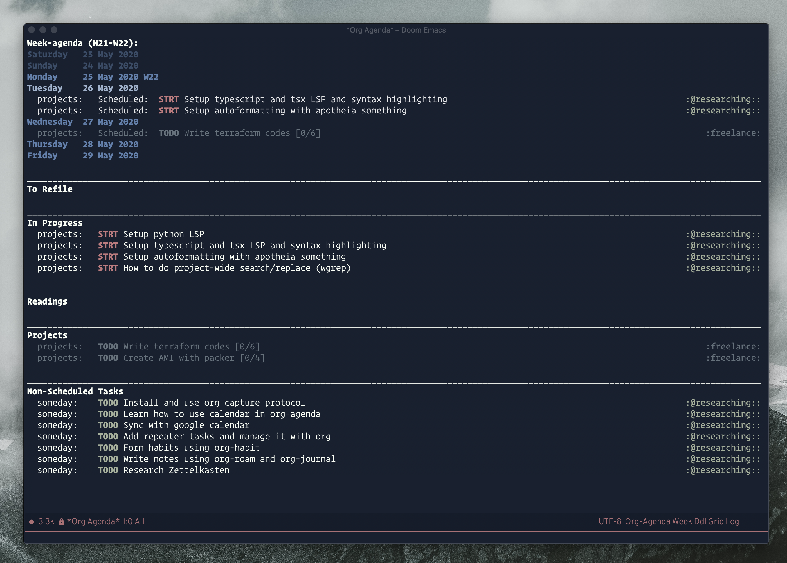

```
____________________________________________________
                     _____      __   ______     __  
                     /    )   /    )   /      /    )
---_--_-------------/----/---/----/---/-------\-----
  / /  ) /   /     /    /   /    /   /         \    
_/_/__/_(___/_____/____/___(____/___/______(____/___
           /                                        
       (_ /                                         
```

I am currently migrating [my vim configuration](.config/nvim) to [Doom emacs](.doom.d)
Feel free to open an issue if you need clarification to my configs

## Screenshots

### Emacs (Editor View)


### Emacs (Org Agenda)




### Vim/Tmux/Alacritty


